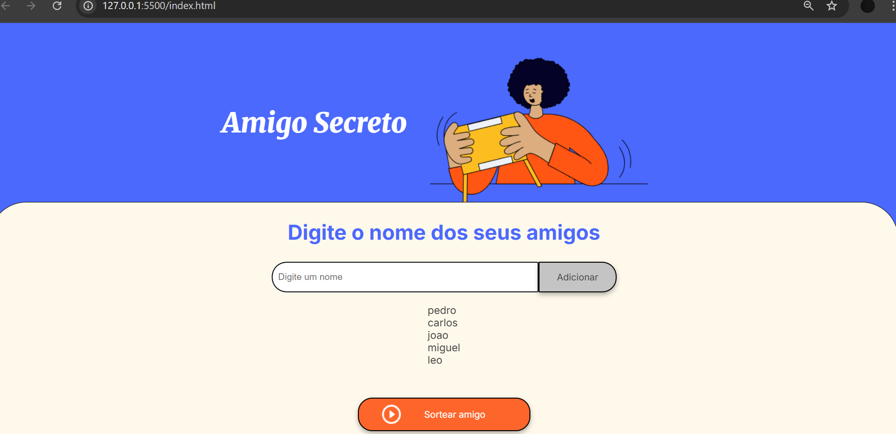
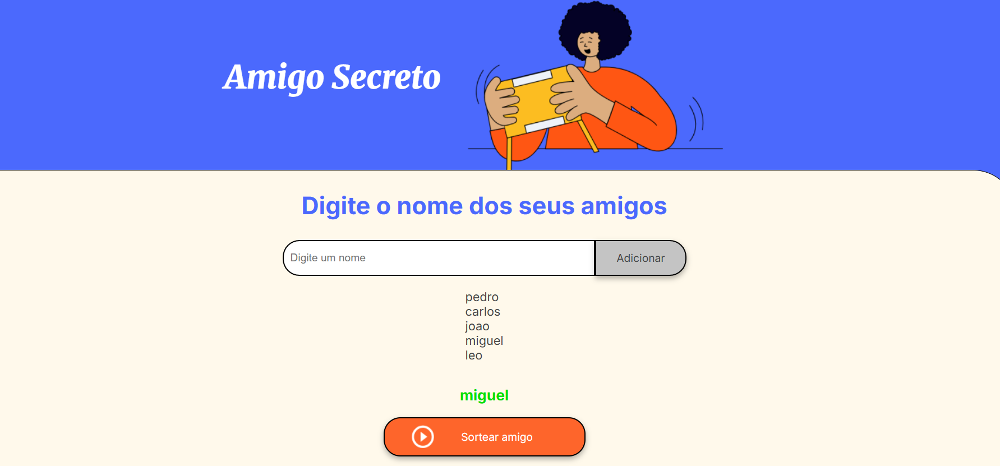

<h1>Challenge do Amigo Secreto</h1>

Site desenvolvido para entregar o desafio de um challenge da alura com ONE, o projeto consiste em um site que permite que você adicione amigos em uma lista e sorteie um desses amigos.

<h2>Funcionalidades: </h2>
<ul>
    <li><strong>Adicione nomes:</strong> Insira o nome de cada participante do Amigo Secreto através de um campo de texto.</li>
    <li><strong>Valide a entrada:</strong> O programa avisa se você tentar adicionar um nome em branco, garantindo que todos os participantes sejam válidos.</li>
    <li><strong>Visualize a lista:</strong> Veja em tempo real a lista de amigos que foram adicionados ao sorteio.</li>
    <li><strong>Realize o sorteio:</strong> Com um clique, um nome aleatório é selecionado da lista, simulando o sorteio do Amigo Secreto.</li>
</ul>

<h2>Como usar: </h2>
<ol>
    <li>Abra o arquivo index.html no seu navegador web.</li>
    <li>Na seção "Digite o nome dos seus amigos", insira o nome de um participante no campo de texto.</li>
    <li>Clique no botão "Adicionar". O nome será adicionado à lista abaixo.</li>
    <li>Repita os passos 2 e 3 para todos os seus amigos que participarão do sorteio.</li>
    <li>Quando todos os nomes estiverem na lista, clique no botão "Sortear amigo".</li>
    <li>O nome do amigo sorteado será exibido na tela.</li>
</ol>

<h3>Tecnologias Usadas: </h3>
<ul>
  <li>HTML(codigo HTML já fornecido com o Challenge)</li>
  <li>CSS(codigo CSS já fornecido com o Challenge)</li>
  <li>HTML(codigo feito por minha autoria)</li>
</ul>

<h2>Autor: </h2>

Caique Borges

